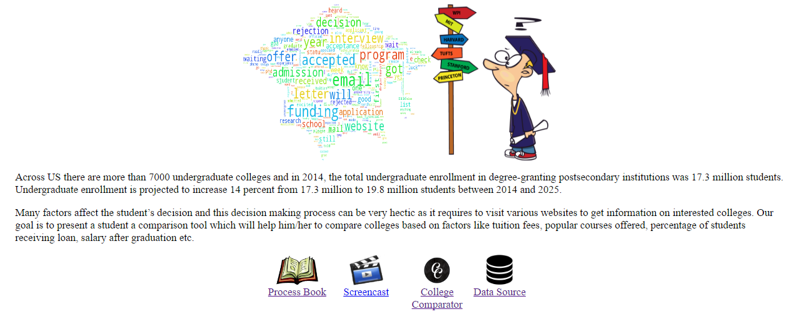
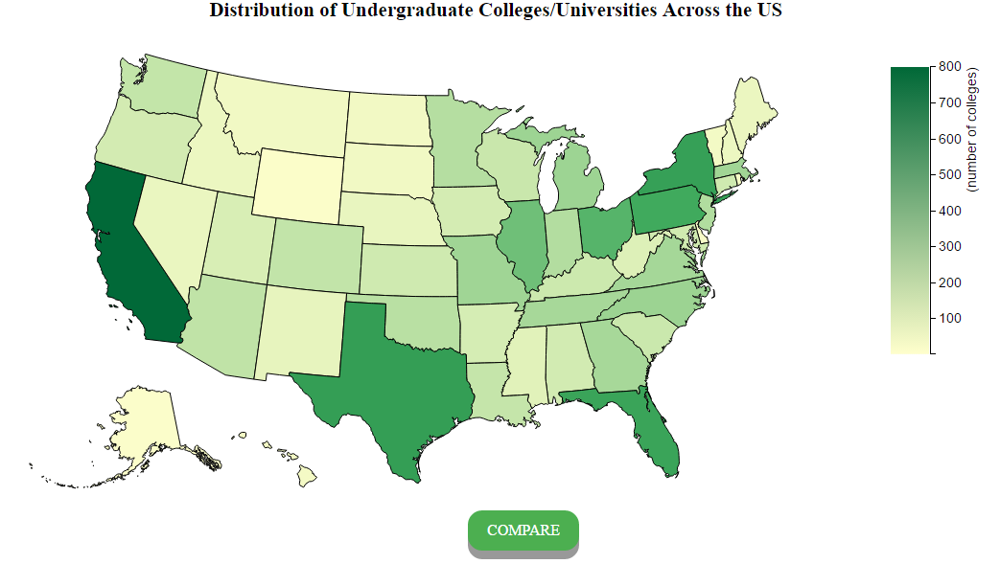
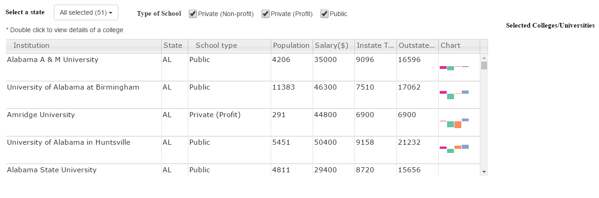
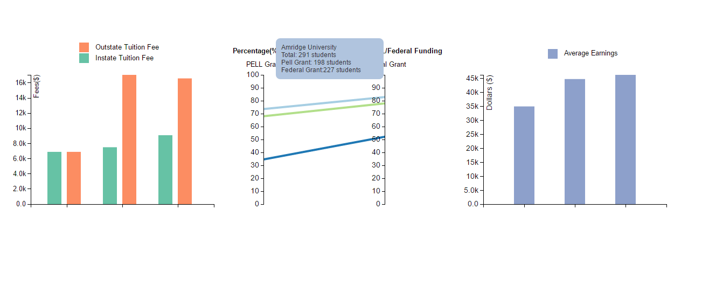

# cs573FinalProject
Visualization of Undergrads enrollment

Team:

1. Kartik Shetty(arsene2803)

2. Kirthika Muthukumaran(kirthim13)

3. Neha Mahajan (nsmahajan)

Handin Folders:

data folder: contains the following files

1. collegeData --> college scorecard data that we use for the visualization which contains information about all the 
   undergraduate colleges in the US.

2. us.tsv --> contains code, name of all the us states which use to map state abbreviation from the above csv.

3. us.json --> used to draw the choropleth map.
			
css folder:

contains the stylesheets, images used in our visualizations.

html files:

1. index.html --> introduction page of the visualization with a short description of what our visualization is about and
few images along with links to screencast, process book and link to our main visualization.

2. indexviz.html --> main page for visualization which holds the layout for all our visualizations and buttons.

scripts folder:

1. data.js --> reads the datasets used for our visualizations.

2. landingPage.js --> visualization with choropleth map which shows the distribution of colleges across the US.	

3. chartPage.js --> Main control page of our visualization which handles filters applied by the user such as 
states, type of schools(public, private (non-profit), private (profit)) and controls other visualizations according
to the visualization. By default, colleges of all types in all the states are selected when the page loads for the first
time.

4. tableChart.js --> Displays a table with list of all the colleges that satisfy the filters applied by user on State and type
of college. 

5. tuitionChart.js --> displays grouped bar chart of in-state tuition fees and outstate tuition fees of the selected colleges
from the table.

6. loanChart.js --> displays a parallel co-ordinate chart which compares the percentage of students who have received PELL grant
and Federal grant in the selected college obtained from the table.

7. salaryChart.js --> displays a bar chart to compare average earnings of students from the selected college obtained from the table.					   				  

External libraries:

1. bootstrap libraries for our multi-select drop down with check box to select state names.

2. jquery to handle the multiselect
 
3. jquery.sparkline to display tooltip for our sparkline bar chart available in the table

4. slick to display table information with scroll and sortable columns.

References:

1. https://github.com/6pac/SlickGrid/blob/master/examples/example-multi-column-sort.html

2. http://davidstutz.github.io/bootstrap-multiselect/

3. https://d3-geomap.github.io/map/choropleth/us-states/